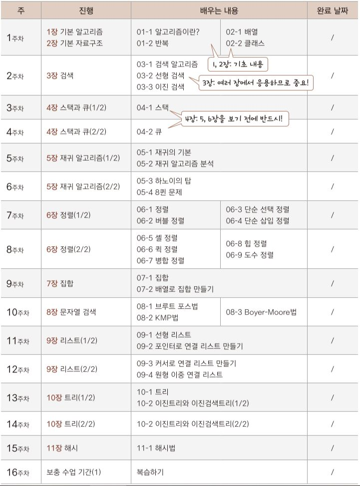

# :computer: algo-study
## 스터디 진행방법 (차후 변경 및 추가)

- 2주차부터 순차적으로 알고리즘 및 자료구조 개념 공부 및 정리
- 이것이 코딩 테스트다 책과 프로그래머스, 백준에서 코테 문제 풀기
- 공부한 부분을 각자 source 개인 폴더 및 content 공용 폴더에 markdown 형식 또는 소스코드로 업로드
- 매주 토요일까지 제출 마감 후 일요일 미팅
  

## Git Repository 사용법
저장소: https://github.com/DEInformatik/algo-study

### 저장소 설명
- source : 팀원 각각의 알고리즘 공부 개인 폴더
- content : 알고리즘 개념과 이론을 정리해 업로드 하는 공용 폴더
- 추후 추가 예정

### 원격저장소 로컬에 가져오기
<code>
git clone https://github.com/DEInformatik/algo-study.git
</code>
 

### 저장소 개인 브랜치 생성하기
<code>
git branch <브랜치 이름>
</code>
 
  
### Workflow
1. **<code> git checkout <브랜치 이름> </code>** (main에서 개인 브랜치로 전환)
2. 로컬 workspace에서 작업 후 **<code>git add ...</code>** 및 **<code>git commit ...</code>**
3. <code>git push origin <브랜치 이름></code> (원격저장소의 개인 브랜치에 작업 반영)
4. <code>git checkout main</code> (개인 브랜치에서 main으로 전환)
5. <code>git pull</code> (원격저장소의 main을 로컬에 적용)
6. <code>git merge <브랜치 이름></code> (main에 개인 브랜치 작업 반영)
7. <code>git push origin main</code> (원격저장소의 main에 작업 반영)
  

## 코테 사이트 및 참고 사이트
- [프로그래머스](https://programmers.co.kr/learn/challenges)
- [백준](https://www.acmicpc.net/problem/tags)
- [이것이 취업을 위한 코딩 테스트다 소스코드](https://github.com/ndb796/python-for-coding-test)
- [weareSoft/tech-interview#1-data-structure](https://github.com/WeareSoft/tech-interview#1-data-structure)
- [wearesoft/algorithm-study](https://github.com/WeareSoft/algorithm-study)
- [알고리즘 공부 시작 방법 및 순서](https://blog.yena.io/studynote/2018/11/14/Algorithm-Basic.html)
- [알고리즘 공부법](https://gmlwjd9405.github.io/2018/05/14/how-to-study-algorithms.html)
