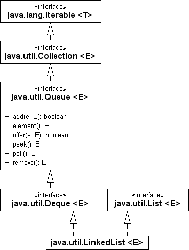
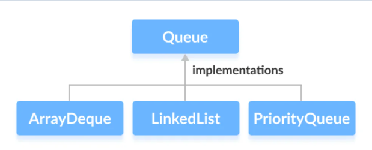
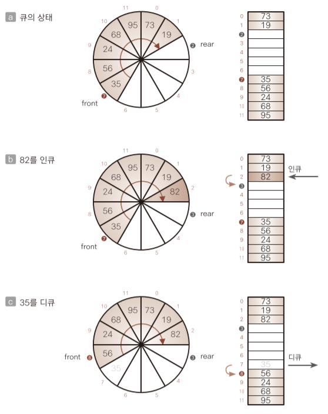
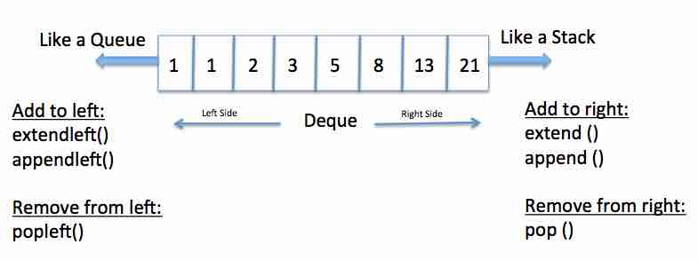

# Stack and Queue 스택과 큐 (자료구조 기본)
자료구조란 _데이터를 표현하고 관리하고 처리하기 위한 구조_ 를 의미한다.<br>
그중 스택과 큐는 자료구조의 기초 개념으로 다음의 두 핵심적인 함수로 구성된다.
- **삽입 Push** : 데이터를 삽입한다.
- **삭제 Pop** : 데이터를 삭제한다.

물론 실제로 스택과 큐를 사용할 때는 삽입과 삭제 외에도 _오버플로와 언더플로_ 를 고민해야 한다.

## Stack 스택 (Kellerspeicher)
스택은 _박스 쌓기_ 에 비유할 수 있다.
_박스는 아래에서부터 위로 차곡차곡 쌓는다. 그리고 아래에 있는 박스를 치우기 위해서는 위에 있는 박스를 먼저 내려야 한다._
이러한 구조를 **후입선출 Last In First Out(LIFO)** 또는 **선입 후출 First out Last In(FOLI)** 구조라고 한다.<br>
One case where stacks are often useful is in certain **recursive algorithms 재귀 알고리즘에 많이 사용됨**.<br>
Sometimes you need to **_push temporary data onto a stack as you recurse, but then remove them as you backtrack 루프를 돌면서 임시데이터를 스택에 넣고, 그 후 백트래킹을 하면서 다시 스택에서 제거_** (for example, because the recursive check failed). <br>
A stack can also be used to **_implement a recursive algorithm iteratively_**. (This is a good exercise! Take a
simple recursive algorithm and implement it iteratively.)
 
```java
// Stack with Array
public class StackArray {
    int top;
    Object[] stack;

    StackArray(int capacity) {
        ptr = 0; // stack pointer
        stack = new Object[capacity];
    }

    void push(Object v) {
        if (ptr >= stack.length) {
            // handling overflow; OverflowIntStackException()
            return;
        } 
        stack[ptr++] = v;
    }

    Object pop() {
        if (ptr == 0) {
            // handling underflow; EmptyIntStackException()
            return null;
        } 
        return stack[--ptr];
    }

    Object peek() {
        if (ptr == 0) {
            throw new EmptyIntStackException();
        }
        return stack[ptr - 1];
    }

    boolean isEmpty() {
        return ptr == 0;
    }

    boolean isFull() {
        return ptr >= stack.length;
    }
}
```
```java
// Stack with List (linked list)
public class StackList<T> {

    private static class StackNode<T> {
        private T data;
        private StackNode<T> next;

        public StackNode<T>(T data) {
            this.data = data;
        }
    }

    private StackNode<T> top;

    void push(T item) {
        StackNode<T> t = new StackNode<T>(item);
        t.next = top;
        top = t;
    }

    T pop() {
        if (top == null) {
            // handling underflow; EmptyIntStackException()
            return null;
        }
        T item = top.data;
        top = top.next;
        return item;
    }

    Object peek() {
        if (top == null) {
            throw new EmptyIntStackException();
        }
        return top.data;
    }

    boolean isEmpty() {
        return top == null;
    }
}
```
**_파이썬_** 의 기본 리스트에서 ```append()```와 ```pop()``` 메서드를 이용하면 스택 자료구조와 동일하게 동작한다. ```append()``` 메서드는 리스트의 가장 뒤쪽에 데이터를 삽입하고, ```pop()``` 메서드는 리스트의 가장 뒤쪽에서 데이터를 꺼낸다.

## Queue 큐
큐는 _대기 줄_ 에 비유할 수 있다. 나중에 온 사람일수록 나중에 들어가기 때문에 흔히 ‘공정한’ 자료구조라고 비유된다. 이러한 구조를 **선입선출 First In First Out(FIFO)** 구조라고 한다.<br>
큐의 _리어(rear)/last_ 에 데이터를 넣는 작업을 **인큐(enqueue); 시간 복잡도 _O(1)_** 라 하고, 데이터를 _프런트(front)/top_ 에서 꺼내는 작업을 **디큐(dequeue); 시간 복잡도 _O(n)_, 데이터를 꺼낸 다음 요소들을 모두 맨 앞으로 옮겨야한다 (Array 기준)**  라 한다.<br>
One place where queues are often used is **in breadth-first search or in implementing a cache BFS 검색이나 캐쉬 구현에 사용됨**.<br> 
In breadth-first search, for example, we used a queue to **_store a list of the nodes that we need to process 처리할 노드의 리스트를 큐에 저장하고_**. Each time we process a node, we **_add its adjacent nodes to the back of the queue 노드를 처리할 때 마다 인접 노드를 큐에 추가한다_**. This allows us to process nodes in the order in which they are viewed.




```java
// queue with List (Linked list)
public class QueueList<T> {

    private static class QueueNode<T> {
        private T data;
        private QueueNode<T> next;

        public QueueNode<T>(T data) {
            this.data = data;
        }
    }

    private QueueNode<T> first;
    private QueueNode<T> last;

    void add(T item) {
        QueueNode<T> t = new QueueNode<T>(item);
        if (last != null) {
            last.next = t;
        }
        last = t;
        if (first == null) {
            first = last;
        }
    }

    T remove() {
        if (first == null) {
            // handling underflow; NoSuchElementException()
            return null;
        }
        T item = first.data;
        first = first.next;
        if (first == null) {
            last = null;
        }
        return item;
    }

    Object peek() {
        if (first == null) {
            throw new NoSuchElementException();
        }
        return first.data;
    }

    boolean isEmpty() {
        return first == null;
    }
}
```

### Ring Buffer 링 버퍼 (Zyklisches Array)
 링 버퍼는 _배열의 처음이 끝과 연결 될 수 있는 큐_ 로 자료구조 크기의 제한과 비어있을 때의 메모리 낭비가 있지만 프런트와 리어 값을 업데이트하며 인큐와 디큐를 수행하기 때문에 시간 복잡도는 **_O(1)_** 이다.

 

```java
class QueueArray implements Queue { 
    int first, last;
    Object[] queue;

    QueueArray(int capacity) { 
        first = 0; 
        last = 0; 
        queue = new Object[capacity];
    }

    void add(Object v) {
        int next = (last + 1) % queue.length;
        if (next == first) {
            // handling overflow;
            return;
        }
        queue[last] = v;
        last = next;
    }

    Object remove() {
        if (first == last) {
            // handling underflow;
            return
        }
        Object x = queue[first];
        first = (first + 1) % queue.length;
        return x;
    }

    boolean isEmpty() {
        return first == last;
    }

    boolean isFull() {
        return (first == (last + 1) % queue.length);
    }
}
```

**_파이썬_** 으로 큐를 구현할 때는 ```collections``` 모듈에서 제공하는 ```deque``` 자료구조를 활용하자.(Deque 또는 Deck 덱) ```deque```는 스택과 큐의 장점을 모두 채택한 것인데 데이터를 넣고 빼는 속도가 리스트 자료형에 비해 효율적이며 ```queue``` 라이브러리를 이용하는 것보다 더 간단하다. 


## 문제 풀기   
1. 프로그래머스 스택 문제
2. 프로그래머스 큐 문제